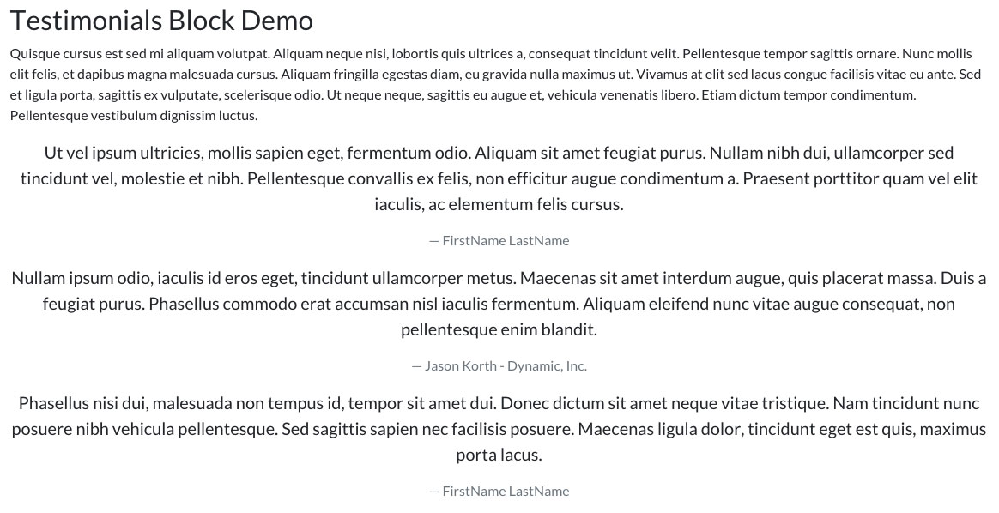
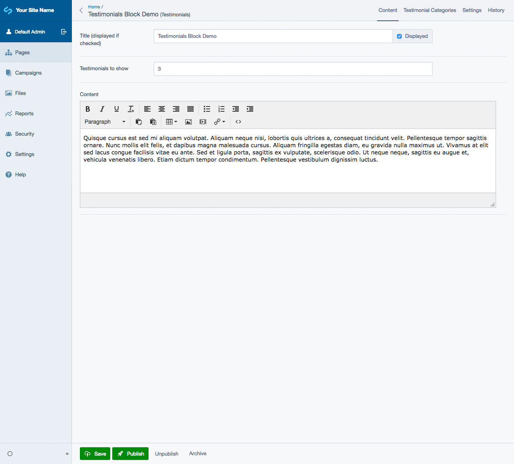
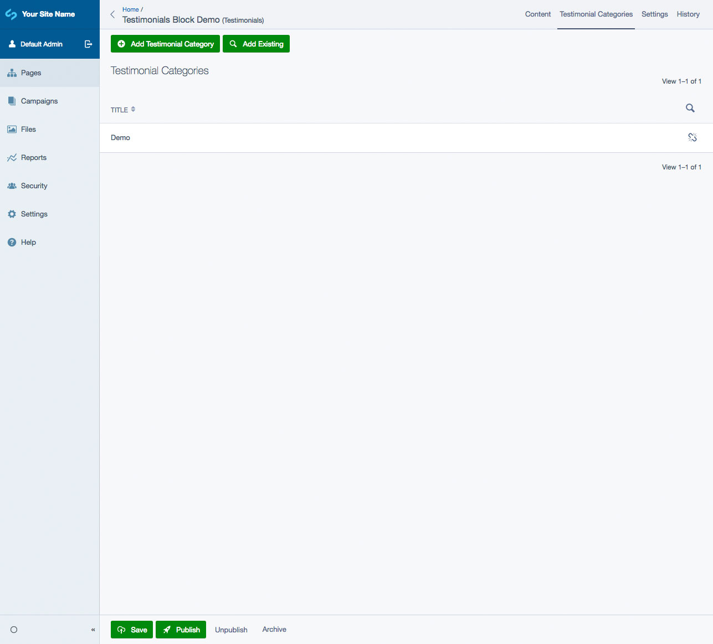
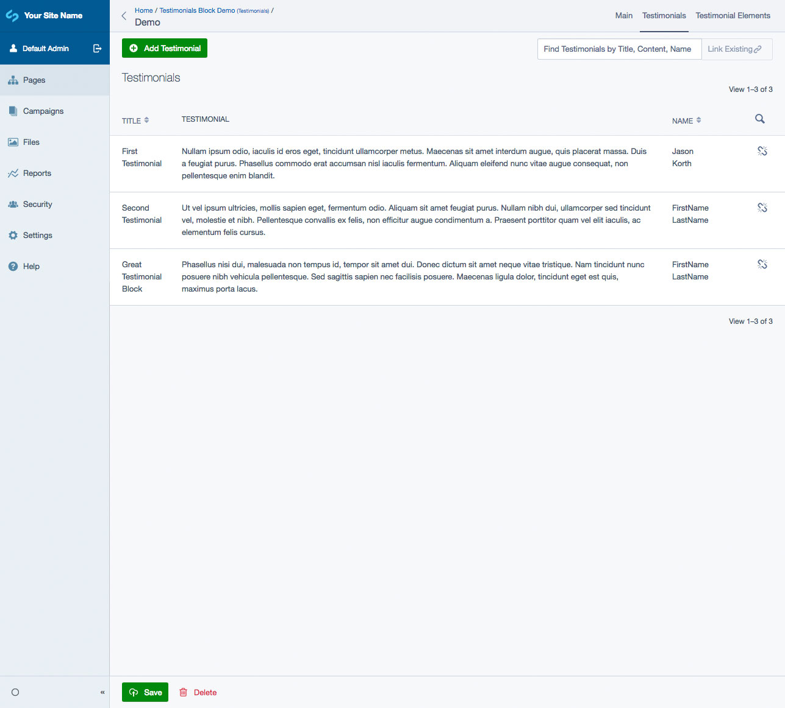
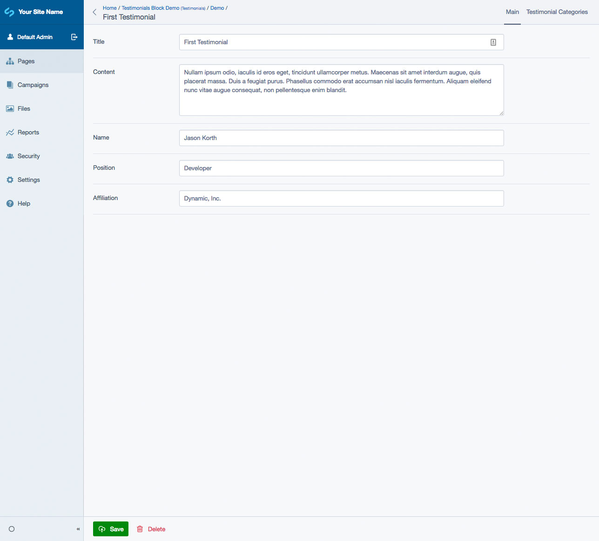

# SilverStripe Elemental Testimonials

Testimonials Block for SilverStripe Elemental.

## Requirements

* Silverstripe ^4.0
* Silverstripe Elemental ^4.0

## Installation

`composer require dynamic/silverstripe-elemental-testimonials`

## License

See [License](license.md)

## Usage

Elemental Testimonials Block will add the following Element to your site:

* Testimonials

The Testimonials Element pulls testimonials from a specified Testimonial Category. They are displayed on the front-end in a random order. You can also set how many should testimonials should display.

Each Testimonial includes the following fields:

* Title
* Content
* Name
* Position
* Affiliation

## Screen Shots

#### Front End sample of a Testimonial Element
The default templates are based off [Bootstrap 4](https://getbootstrap.com/) classes/styling

#### CMS - Testimonials Main Tab

#### CMS - Testimonials Category Tab

#### CMS - Testimonials List

#### CMS - Testimonials Edit

## Getting more elements

See [Elemental modules by Dynamic](https://github.com/orgs/dynamic/repositories?q=elemental&type=all&language=&sort=)

## Configuration

See [SilverStripe Elemental Configuration](https://github.com/dnadesign/silverstripe-elemental#configuration)

## Maintainers

*  [Dynamic](http://www.dynamicagency.com) (<dev@dynamicagency.com>)

## Bugtracker
Bugs are tracked in the issues section of this repository. Before submitting an issue please read over
existing issues to ensure yours is unique.

If the issue does look like a new bug:

- Create a new issue
- Describe the steps required to reproduce your issue, and the expected outcome. Unit tests, screenshots
  and screencasts can help here.
- Describe your environment as detailed as possible: SilverStripe version, Browser, PHP version,
  Operating System, any installed SilverStripe modules.

Please report security issues to the module maintainers directly. Please don't file security issues in the bugtracker.

## Development and contribution
If you would like to make contributions to the module please ensure you raise a pull request and discuss with the module maintainers.
