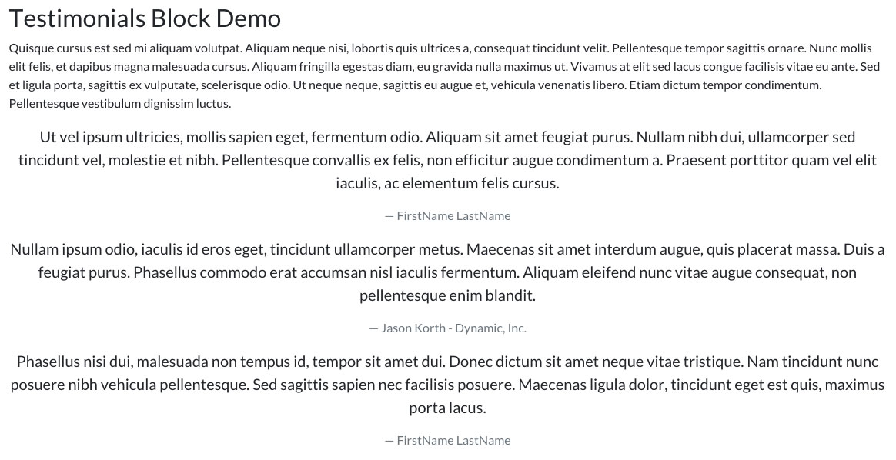
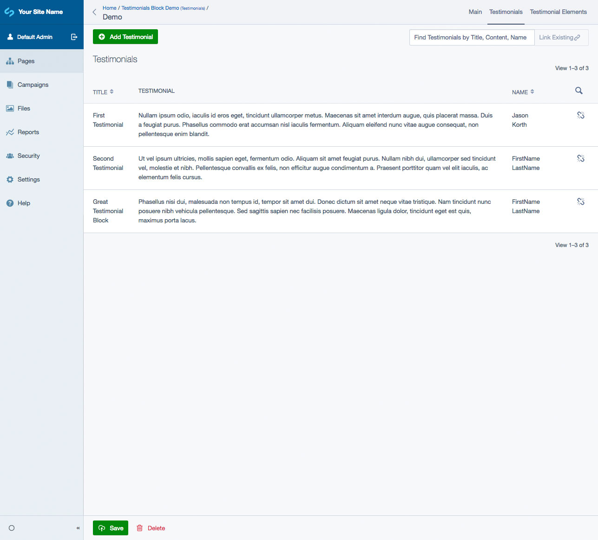
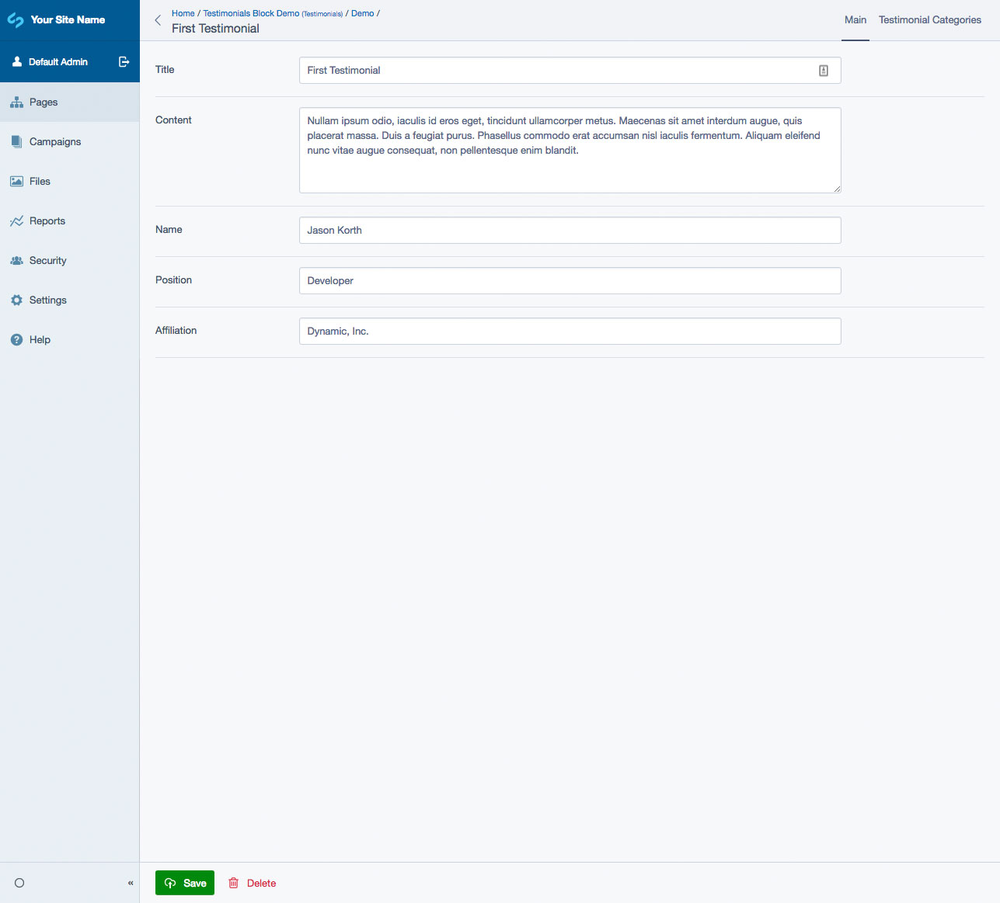

# SilverStripe Elemental Testimonials

Testimonial Element for SilverStripe 4.

## Requirements

* SilverStripe ^4.0
* SilverStripe Elemental ^2.0

## Installation

`composer require dynamic/silverstripe-elemental-testimonials`

## Usage

Elemental Testimonials Block will add the following Element to your site:

* Testimonials

The Testimonials Element pulls testimonials from a specified Testimonial Category. They are displayed on the front-end in a random order. You can also set how many should testimonials should display.

Each Testimonial includes the following fields:

* Title
* Content
* Name
* Position
* Affiliation

## Screen Shots

#### Front End sample of a Testimonial Element
The default templates are based off [Bootstrap 4](https://getbootstrap.com/) classes/styling

#### CMS - Testimonials Main Tab

#### CMS - Testimonials Category Tab

#### CMS - Testimonials List

#### CMS - Testimonials Edit

## Getting more elements

See [Elemental modules by Dynamic](https://github.com/dynamic/silverstripe-elemental-blocks#getting-more-elements)

## Configuration

See [SilverStripe Elemental Configuration](https://github.com/dnadesign/silverstripe-elemental#configuration)
